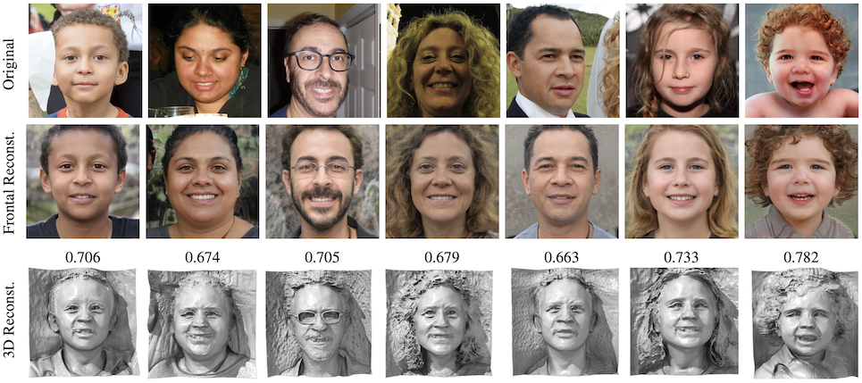

# GaFaR: Geometry-aware Face Reconstruction

[Project page](https://www.idiap.ch/paper/gafar/)



## Installation
You can use the following command to create and activate your Python environment:
```sh
conda env create -f environment.yml
conda activate gafar
```

## Training face reconstruction model
We use [EG3D](https://github.com/NVlabs/eg3d) as a pretrained face generator network based on generative neural radiance fields (GNeRF). Therefore, you need to clone its git repository and download [available pretrained model](https://catalog.ngc.nvidia.com/orgs/nvidia/teams/research/models/eg3d):
```sh
$ git clone https://github.com/NVlabs/eg3d.git
```
We use `ffhqrebalanced512-128.pkl` [checkpoint](https://catalog.ngc.nvidia.com/orgs/nvidia/teams/research/models/eg3d/files) in our experiments.

To train the face reconstruction model, you can use `train.py`. For example, for blackbox attack against `ElasticFace` using `ArcFace` in loss function, you can use the following commands:
```sh
python train.py --path_eg3d_repo <path_eg3d_repo>  --path_eg3d_checkpoint <path_eg3d_checkpoint>       \
                --FR_system ElasticFace   --FR_loss  ArcFace  --path_ffhq_dataset <path_ffhq_dataset>  \
```

## Pre-trained models (GaFaR Mapping Network)
[Checkpoints](https://www.idiap.ch/paper/gafar/static/files/checkpoints.zip) of trained models of the mapping network for whitebox and blackbox attacks are available in the [project page](https://www.idiap.ch/paper/gafar/).


## Evaluation
For evaluation script and also access to the dataset of presentation attack using the reconstructed face images, please check the [project page](https://www.idiap.ch/paper/gafar/).

## Citation
```bibtex
  @article{tpami2023ti3d,
    author    = {Hatef Otroshi Shahreza and S{\'e}bastien Marcel},
    title     = {Comprehensive Vulnerability Evaluation of Face Recognition Systems to Template Inversion Attacks Via 3D Face Reconstruction},
    journal   = {IEEE Transactions on Pattern Analysis and Machine Intelligence},
    year      = {2023},
    volume    = {45},
    number    = {12},
    pages     = {14248-14265},
    doi       = {10.1109/TPAMI.2023.3312123}
  }

  @inproceedings{iccv2023ti3d,
    author    = {Hatef Otroshi Shahreza and S{\'e}bastien Marcel},
    title     = {Template Inversion Attack against Face Recognition Systems using 3D Face Reconstruction},
    booktitle = {Proceedings of the IEEE/CVF International Conference on Computer Vision (ICCV)},
    pages     = {19662--19672},
    month     = {October},
    year      = {2023}
  }
```